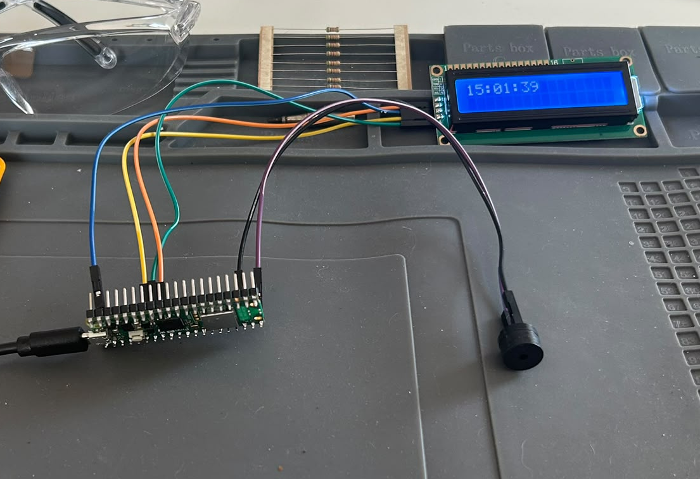
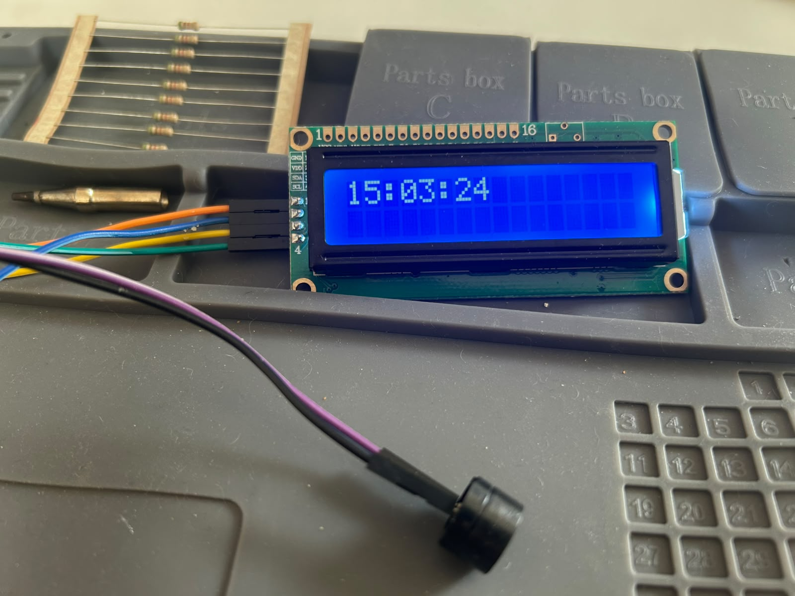

# Raspberry Pi Pico 2 W Alarm Clock
A digital alarm clock built with a Raspberry Pi Pico 2 W and MicroPython. 
It displays the current time on a 16x2 I2C LCD and activates a passive buzzer when the selected alarm time is reached.

## Features

- The current hour, minute and second can be set through the console, along with the alarm time.
- When the clock reaches the selected alarm time, the passive buzzer plays a 2000 Hz tone for ten seconds.

## Hardware

- Raspberry Pi Pico 2 W
- 16x2 LCD with I2C interface
- Passive buzzer
- Female-to-female jumper wires
- 3 tactile push buttons for Up, Down and Menu/OK controls

## Pin connections

| Component | Pico connection |
|---|---|
| LCD SDA | GP4 (physical pin 6) |
| LCD SCL | GP5 (physical pin 7) |
| LCD GND | GND (physical pin 8) |
| LCD VCC | VBUS (physical pin 40) |
| Passive buzzer signal | GP15 (physical pin 20) |
| Passive buzzer ground | GND |
| Menu/OK button | GP14 (physical pin 19) |
| Menu/OK button ground | GND |

## Software

- MicroPython
- Thonny IDE
- `I2C_LCD.py` and `LCD_API.py` for controlling the LCD

## How it works

The clock advances once per second using `ticks_ms()` and `ticks_diff()`. 
The current time is shown on the LCD, and the buzzer produces a 2000 Hz tone for ten seconds when the selected alarm time is reached.

Physical button input is currently being integrated. The first Menu/OK button has been successfully tested on GP14 using the Pico's internal pull-up resistor.

## Dependencies and credits

This project uses Freenove's `I2C_LCD.py` and `LCD_API.py` MicroPython files to control the LCD. These files are not included in this repository and must be installed on the Raspberry Pi Pico alongside `main.py`.

They can be downloaded from the [Freenove LCD Module repository](https://github.com/Freenove/Freenove_LCD_Module).

The LCD library files are licensed under CC BY-NC-SA 3.0. The alarm clock logic in `main.py` is my own work.

## 3D-printed enclosure

Development of a modular two-piece enclosure is in progress.

Front panel version 05 has been designed in Fusion 360 and physically test printed. It includes an LCD opening, LCD mounting posts, a sound grille and a rear buzzer clip.

The remaining enclosure will be designed as a single box-shaped body, with the front panel attached as a removable front cover.

- [Front panel design files and documentation](enclosure/front-panel)

## Project status

Working prototype. The clock, LCD display and alarm buzzer are functioning. The first physical Menu/OK button has also been successfully tested on GP14. 
Time and alarm configuration through the physical controls and LCD menu is currently under development.

## Planned improvements

- Integrate Up, Down and Menu/OK buttons for setting the time and alarm
- Alarm on/off control
- Menu system shown on the LCD
- Alternating buzzer tones using two different frequencies
- Portable power supply
- Complete the main enclosure body and front-panel mounting system

## Running the project

1. Connect the Raspberry Pi Pico 2 W to a computer using USB.
2. Open `main.py` in Thonny.
3. Make sure `I2C_LCD.py` and `LCD_API.py` are installed on the Pico.
4. Run the program.
5. Enter the current hour, minute and second in the console.
6. Enter the desired alarm hour and minute.
